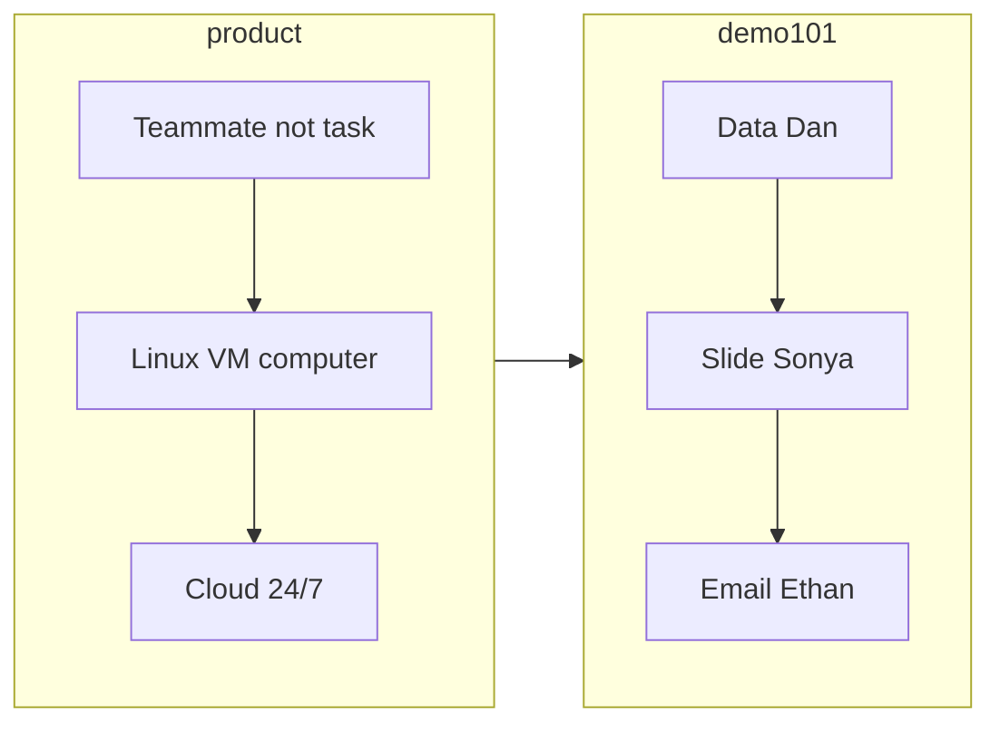

# Grok Bot Galaxy (unofficial field notes)

**Day 1 clips 01–18 are in.** This is a working field guide to [Grok Bot](https://x.ai) as shown at Grok Bot Galaxy — written so a human can learn it and a Grok Bot / agent can ingest the whole thing in one pass.

Not affiliated with xAI. Maintainer: [etor6233](https://github.com/etor6233) (only this account pushes).

## Agents

Read **[`llms.txt`](llms.txt)** then **[`AGENTS.md`](AGENTS.md)** then **[`knowledge/INDEX.md`](knowledge/INDEX.md)**. Do not guess product behavior.

## Humans

1. [What Grok Bot is](knowledge/canon/explanation/why-grok-bot.md)
2. [How to create a bot](knowledge/canon/how-to/create-a-bot.md) → [computer](knowledge/canon/how-to/use-the-computer.md) → [teach a task](knowledge/canon/how-to/teach-a-task.md)
3. [INDEX](knowledge/INDEX.md) for everything else
4. [Timelines](knowledge/timelines/) if you need the timestamp and who said it

## What is not in git

Livestream recordings, Whisper models, raw OCR/ASR, and keyframes stay on the maintainer machine. This repo is the **distilled source of truth** only. Later videos land as new timelines + canon patches, same contract.

## License

MIT for these notes. Product names belong to their owners.
