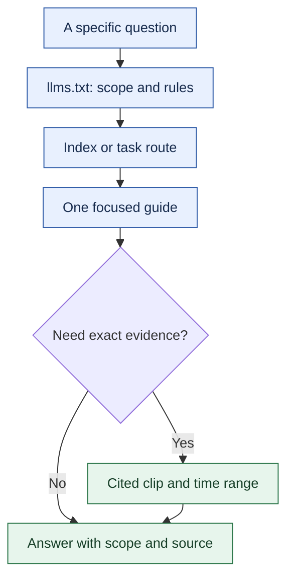
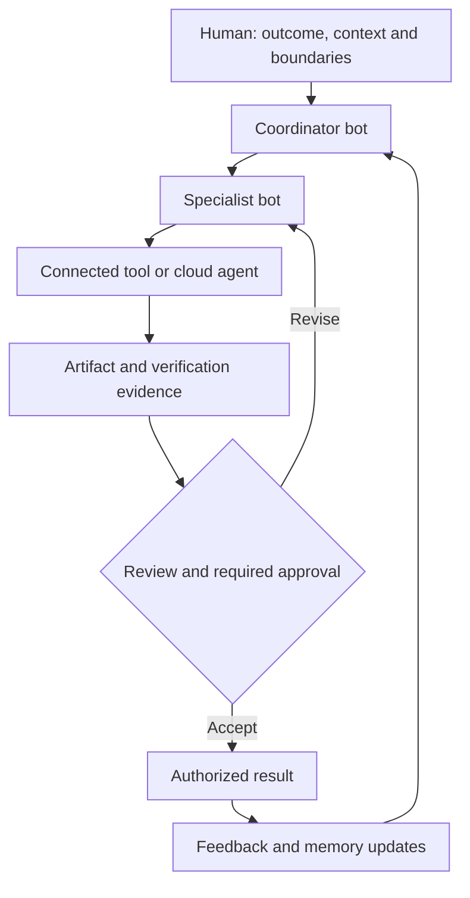
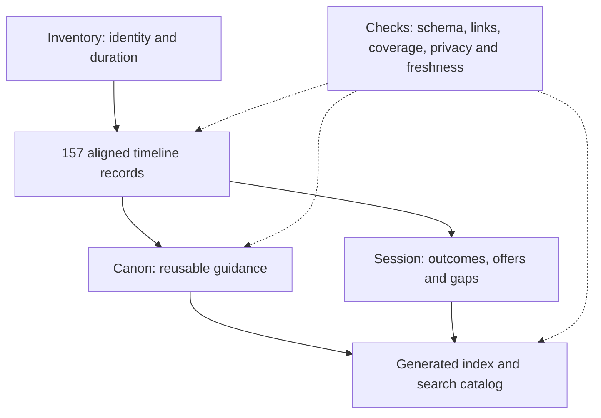

# Grok Bot Galaxy

**Learn the workflows. Inspect the evidence. Read only what you need.**

An unofficial field guide to Grok Bot Galaxy, **15-17 September 2026**: persistent bots, verified engineering, product management, sales, support, operations and marketing. The library covers **157 recordings across three days**, approximately **24 h 16 min of captured material**, including retransmissions. It preserves the demos' successes, failures and unresolved questions.

[Start with a task](knowledge/ROUTES.md) · [Complete index](knowledge/INDEX.md) · [Agent entrypoint](llms.txt) · [Timeline evidence](knowledge/timelines/INDEX.md) · [Coverage](knowledge/_meta/coverage.yaml)

Maintained by [etor6233](https://github.com/etor6233). Independent notes; not affiliated with xAI. The recordings describe the product at the event, not its current specification. **Para empezar:** elegí una tarea en la [guía de navegación](knowledge/ROUTES.md); las notas conservan el inglés de las sesiones para mantener nombres y citas consistentes.

## Start using the guide

| Your job | Read first |
|---|---|
| Create your first useful bot | [Create a bot](knowledge/canon/how-to/create-a-bot.md) and [teach a task](knowledge/canon/how-to/teach-a-task.md) |
| Coordinate specialists and control cost | [Operate a bot team](knowledge/canon/how-to/operate-a-bot-team.md) and [reduce token use](knowledge/canon/how-to/reduce-bot-token-use.md) |
| Build and verify software | [Verification workflow](knowledge/canon/how-to/build-and-maintain-verification.md) and [feedback and fixes](knowledge/canon/how-to/triage-feedback-and-verify-fixes.md) |
| Turn product evidence into delivery | [Data to PRD, design and engineering](knowledge/canon/how-to/turn-product-data-into-a-prd.md) |
| Run revenue and customer work | [Sales engineering](knowledge/canon/how-to/run-sales-engineering.md), [sales](knowledge/canon/how-to/run-sales-workflows.md), [SDRs](knowledge/canon/how-to/run-sdr-prospecting.md), [support](knowledge/canon/how-to/run-customer-support.md) |
| Run operations and marketing | [RevOps](knowledge/canon/how-to/run-revops-task-handoffs.md), [post-sales](knowledge/canon/how-to/run-post-sales-desk.md), [campaigns](knowledge/canon/how-to/orchestrate-marketing-campaign.md) |

## How bots consume this repository



The arrows describe a reading path. Guides link directly to evidence; replay records point back to original clips. There is no duplicated full-corpus prompt. The generated [catalog](knowledge/catalog.json) holds metadata and word counts. Local search returns bounded excerpts without an external API:

```bash
python -m pip install -r requirements-dev.txt
python scripts/search.py "sales handoff" --limit 3
python scripts/search.py "approvals" --max-chars 600 --json
python scripts/search.py "moderation" --kind timelines --limit 2
```

Output size is configurable. Word counts are measured; token savings depend on the model and retrieval pattern, and are not a guaranteed percentage.

## What the event demonstrated



This is an editorial synthesis of [team operation](knowledge/canon/how-to/operate-a-bot-team.md) and [verification](knowledge/canon/how-to/build-and-maintain-verification.md). A coordinator assigns scoped jobs, specialists use tools, and evidence returns for review. The event used different approval policies in different workspaces; this is not a universal built-in workflow. A bot saying "done", a merged PR and a verified production result remain distinct.

## Coverage and provenance

| Recording day | Clips | Captured duration* | Main sessions |
|---|---:|---:|---|
| 15 September | 01-064 (64) | 10 h 04 min | Introduction, 101, engineering, product managers, founders |
| 16 September | 065-112 (48) | 7 h 22 min | Sales engineering, sales, SDRs, customer support |
| 17 September | 113-157 (45) | 6 h 50 min | Marketing operations, post-sales, marketing and closing build |

*Rounded per day; includes 13 replay records (030-042), breaks and partial clips. Total uses precise durations where available and recorded durations for the initial clips. This is coverage of the supplied recordings, not a claim to capture every minute of the livestream.*



Every timeline block records **Spoken / On screen / Actions / Facts**. Distillation means each clip was reviewed for reusable guidance; replay, break and session-only details remain in timelines. Extraction warnings and gaps stay in [coverage](knowledge/_meta/coverage.yaml) and the [gap register](knowledge/session/gaps.md). The [evidence policy](knowledge/_meta/evidence-policy.md) explains what validation can establish.

The closing recording matters: the team reported a production outage and recovery, while the final sponsorship attempt still failed moderation. [Day 3 outcomes](knowledge/session/day-3-outcomes.md) preserves those limits and the final timestamped metrics. No earned sponsorship revenue is inferred.

## Maintain and verify

```bash
python -m pip install -r requirements-dev.txt
python scripts/build_catalog.py
python scripts/validate_timelines.py
python scripts/validate_repository.py
python -m unittest discover -s scripts/tests
```

GitHub Actions runs public-data checks on pushes and pull requests. [Maintenance instructions](CONTRIBUTING.md) cover dated corrections, indexes and the optional local capture pipeline. Recordings, raw speech/OCR, frames, credentials and unrelated desktop material are excluded from publication.

## License

[MIT](LICENSE) for authored notes and code. Product names, third-party material and trademarks belong to their respective owners; this does not grant rights to the recordings.
