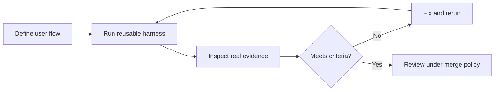

# Build a reusable verification loop

Source: Day 1, 2026-09-15. Lauren's Ship by Thursday demo, [027](../../timelines/027.md)–[028](../../timelines/028.md), continued in [043](../../timelines/043.md)–[047](../../timelines/047.md). This describes the demonstrated workflow; pstack commands and paths are historical examples.

## Outcome

Give a coding agent a repeatable way to run the app, exercise a user flow, and return evidence. Lauren explicitly connected reusable tools with fewer tokens and less inconsistent, freshly generated verification code. [028, 00:00–01:00](../../timelines/028.md)

## Procedure

1. Name the repository, the user flow, and the expected result. In the demo, steve delegated to tater, which launched a Cursor cloud agent for the waitlist signup path. [027, 07:44–09:21](../../timelines/027.md)
2. Have the agent inspect the app's **Surface, Run, Drive, Observe, Isolate** requirements. The displayed `create-verification-skill` recipe generated `.cursor/skills/verify-<app>/`, reusable helpers, and a feature map. [028, 01:00–03:15](../../timelines/028.md)
3. Record how a user reaches each feature, how the harness drives it, and its gotchas. The example feature entry used four sections: **Sub-features**, **How to get to it (user POV)**, **Driving it with <harness>**, **Gotchas**. [028, 01:00–03:15](../../timelines/028.md)
4. Execute the generated workflow before calling it complete. The demo built launch/doctor/cleanup helpers and a Playwright driver, fixed its first failed run, then exercised signup, duplicate handling, and persistence against PGlite. [028, 03:15–05:30](../../timelines/028.md)
5. Review the evidence itself. A follow-up corrected a weak assertion by proving email **and role in the same database row**, armed the response waiter before submit, and added a one-shot runner that propagated failures. [043, 06:20–08:20](../../timelines/043.md)
6. Update the feature map when the product changes. The demo expanded from waitlist-only to waitlist plus venue tools. Define which changes need screenshots, video, command output, or performance comparisons, and verify the delivery path works. [045, 05:55–06:45](../../timelines/045.md); [046, 05:00–09:30](../../timelines/046.md)

## Evidence contract shown

| Change | Evidence shown or requested |
|---|---|
| UI behavior | Real app screenshot plus accessibility/ARIA snapshot; playable video when requested |
| CLI behavior | Command, output, and exit status |
| Data mutation | A separate read-only view confirming the result |
| Performance | Before/after measurements |

Sources: [028, 01:00–03:15](../../timelines/028.md); [026, 04:35–05:03](../../timelines/026.md).

This diagram summarizes the demonstrated loop; it is not a product architecture diagram.

## Failures worth recognizing

- **Evidence exists but cannot be delivered:** a Cursor team setting blocked inline PR images; enabling artifacts, manual upload, and artifact links were offered as options. [047, 02:30–04:40](../../timelines/047.md)
- **File exists but is not evidence:** a generated MP4 was zero bytes; the team required a re-recording. [046, 08:00–09:30](../../timelines/046.md)
- **Policy exists but cannot be followed:** review blocked the media policy because upload had not been proven and exemptions were undefined. [046, 06:50–08:00](../../timelines/046.md)
- **Proof pollutes the code branch:** the team moved proof to a gitignored directory; the earlier FlyLo rules used hosted artifacts in PR bodies. These are demonstrated repository policies, not universal Grok Bot defaults. [025, 00:00–02:00](../../timelines/025.md); [043, 00:00–01:10](../../timelines/043.md)

Related: [PR review routing](wire-pr-reviews-into-slack.md), [token efficiency](reduce-bot-token-use.md).
