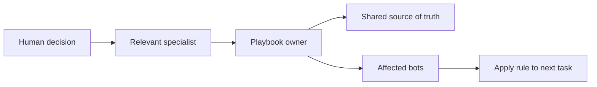

# Maintain shared bot rules without repeating them

Source: Lingxi Li's Day 1 engineering workshop, 2026-09-15, [025](../../timelines/025.md)–[026](../../timelines/026.md). This is the FlyLo demo fleet's operating pattern, not an automatically installed global policy.

## Use one owner and one change path

1. Assign an operations bot to own the shared playbook. Jenny was the sole editor; engineering bots could propose changes. [025, 04:10–06:30](../../timelines/025.md)
2. Resolve ownership conflicts explicitly. The existing page still named Craig as owner; Jenny surfaced the contradiction and the human confirmed “Jenny owns edits.” [026, 01:16–02:00](../../timelines/026.md)
3. Teach a rule to the specialist who understands it, then ask that specialist to send it to the playbook owner. Craig handed Jenny the P0 workflow. [026, 02:00–02:55](../../timelines/026.md)
4. Ask the owner to update the shared source and announce the rule to the affected bots. Jenny confirmed the P0 section and distributed it, then did the same for proof requirements. [026, 02:55–05:03](../../timelines/026.md)
5. Keep execution state on a board rather than filling every conversation with every task. The demo manager used the Notion fleet board to track roughly 20 cloud agents. [026, 05:03–06:29](../../timelines/026.md)

## Keep policy distinct from status

The **playbook** holds stable workflow rules; the **board** holds task, owner, stage, PR, cloud agent, and last commit. Follow-ups to an unmerged PR stay with its existing row and agent. This prevents duplicated ownership and reduces context reloads. [025, 00:00–02:00](../../timelines/025.md)

For a changing business, the company-build team also created a Knowledge Base Manager: first ask-before-writing, later a five-minute routine extracting only the most important details into Notion. The hosts explicitly rejected dumping every conversation. These were successive instructions, not one fixed default. [043, 08:20–08:51](../../timelines/043.md); [045, 05:55–06:45](../../timelines/045.md)

Related: [fleet rules](../reference/flylo-engineering-fleet.md), [bot-to-bot onboarding](onboard-a-new-bot-bot-to-bot.md), [P0 monitoring](escalate-urgent-work-p0.md).
