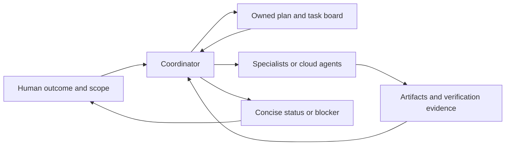

# Coordinate a bot team around shared evidence

> Dated addition — Day 2, 2026-09-16. Derived from the Cupcake build and workshop patterns. Named bots, plugin playbooks, schedules, repositories, and approval choices belong to the demonstrations.

Keep the outcome, current plan, and completion evidence in one place. Delegate distinct jobs, then require the coordinator to inspect their results. The Cupcake engineering bot was explicitly described as a coordinator responsible for quality, rather than a pass-through for agent summaries. [084 · 00:08:40–00:09:58](../../timelines/084.md).

## Establish the operating loop

1. **State the goal and current scope.** Link the plan, define what completion means, and ask the bot to restate a long brief before starting. Lauren and Matt reused the same plan instead of retelling it to each agent. [072 · 00:02:05–00:04:00](../../timelines/072.md), [073 · 00:00:00–00:02:20](../../timelines/073.md).
2. **Assign clear responsibilities.** The chief of staff held project context; Dr. Eggbot created specialists; the engineering coordinator supervised cloud agents. Start with fewer roles and add a specialist when the work requires it. The support and SDR workshops explicitly warned against unnecessary bot proliferation. [073 · 00:00:00–00:02:20](../../timelines/073.md), [101 · 00:05:55–00:09:05](../../timelines/101.md), [108 · 00:08:31–00:09:52](../../timelines/108.md).
3. **Maintain one current project record.** Use an owned plan/board for priorities and decisions. In the demo, Notion held the current game design and task state; Slack carried notifications and handoffs. Bots were told where the source of truth lived. This is a configured convention, not automatic cross-bot access to all memory. [103 · 00:01:45–00:05:40](../../timelines/103.md), [105 · 00:07:33–00:09:54](../../timelines/105.md), [107 · 00:02:09–00:03:30](../../timelines/107.md).
4. **Separate exploration from implementation.** Build bounded prototypes when the approach is unclear, inspect them, and hand the chosen direction to implementation. Cupcake used local game-loop prototypes, animation comparisons, and rejected visual mockups that invented mechanics. [075 · 00:01:30–00:09:59](../../timelines/075.md), [077 · 00:05:00–00:07:20](../../timelines/077.md), [084 · 00:06:10–00:08:40](../../timelines/084.md).
5. **Require evidence of completion.** The demonstrated engineering plan required file, log, screenshot, test, metric, or commit evidence for checklist items. Agents exercised the full user flow; a green deployment check still concealed a broken preview until someone opened it. [072 · 00:04:00–00:06:30](../../timelines/072.md), [073 · 00:05:20–00:07:00](../../timelines/073.md), [082 · 00:06:30–00:08:10](../../timelines/082.md).
6. **Publish a compact state update.** The Knowledge Base Manager maintained a rolling Fleet Pulse with durable facts, updated in place, and requested attention only when needed. Its five-minute demo cadence is not a default recommendation. [104 · 00:05:45–00:09:58](../../timelines/104.md).

Diagram: synthesis of the cited Day 2 coordination examples.

## Correct the system when it drifts

Treat a recurring mistake as a candidate for a durable role/skill change. Keep that change general enough to reuse; Matt warned that rules can overfit to the conversation that created them. Ask the bot factory to audit bottlenecks when the human becomes the handoff point for every task. [084 · 00:03:10–00:06:10](../../timelines/084.md), [112 · 00:05:00–00:07:25](../../timelines/112.md).

The livestream changed between direct-to-main work and PR review, and later deferred some tests. Those are historical team decisions, not a universal delivery policy. Choose review and approval rules for the actual project and verify that they operate; Grok Bot's **Ask first** rules take priority when rules conflict. [083 · 00:00:00–00:07:10](../../timelines/083.md), [106 · 00:03:15–00:05:10](../../timelines/106.md), [071 · 00:06:55–00:08:55](../../timelines/071.md).

Related: [shared playbook](maintain-a-shared-playbook.md), [token usage](reduce-bot-token-use.md), [Day 2 evidence map](../reference/day-2-workflows.md).
