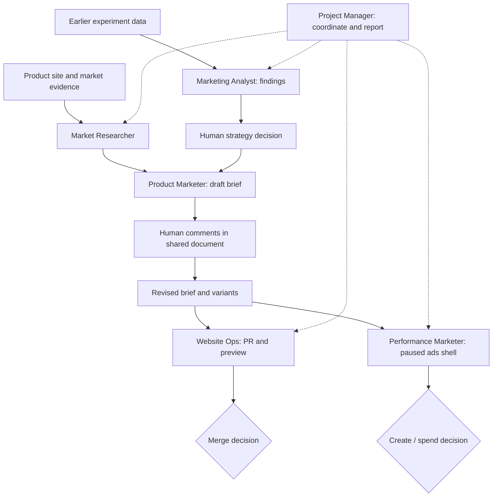

# Orchestrate a marketing campaign across specialist bots

Evidence: Day 3, 2026-09-17. Josh Kim used the **X-Air** demo brand. The displayed campaign results are session examples, not independently verified business outcomes.

**Before starting (editorial clarification, 2026-09-22):** provide the product/site and approved claims, access to the shared Docs/Sheets, the relevant Google Ads account and campaign data, and a marketing repository plus development/preview tools for the website lane. Verify the analyst's data-reading access separately from permission to create or change campaigns. Repository access does not itself authorize deployment, merging or ad spend; carry the human decision gates below into the actual setup. These connections were already configured in the demo; reading this guide does not provision them. [149, 00:01:40–00:05:47](../../timelines/149.md), [150, 00:00:00–00:01:19](../../timelines/150.md).

1. **Market Researcher:** study the product site, competitors and positioning gaps. Ask for the product/market read, comparative evidence and possible angles.
2. **Product Marketer:** get the research directly from the other bot. Draft positioning, audience, one-liners, value statements and examples across a few surfaces in a shared document.
3. **Human review:** comment in the Google Doc, then ask the bot to incorporate the comments. The demo's Google Docs connection let it retrieve that feedback and revise the brief.
4. **Website Ops and Performance Marketer:** run independent implementation tasks from the approved brief. Website Ops builds a landing-page PR and preview screenshots; Performance Marketer prepares campaign variants and an ads shell.
5. **Marketing Analyst:** retrieve the experiment data, summarize metrics and recommend decisions. Keep recommendations separate from actions such as scaling spend or merging a page.
6. **Project Manager:** after the workflow is understood, have it learn specialist ownership, handoffs and the points where you intervened. Make it the single point of contact while retaining the explicit decision gates.

The new Google Ads shell was **Paused**, used **Maximize clicks**, and reported **No spend**. The analysis came from an earlier campaign the presenter said had already run. These were separate objects: analysis did not prove that the new shell went live.

Website Ops initially held the landing page at PR/preview. Later, the demo reported a production push. The Project Manager then locked three further campaigns while carrying forward **hold merge/spend** and asking to be the sole point of contact. That was a handoff and scope decision, not evidence that all three campaigns completed.

The brief also constrained copy: no unsupported fleet, punctuality, Wi-Fi or fare claims, and no named competitors in public creative. Preserve claim boundaries alongside the creative direction when passing work between bots.

Josh built his specialist using a dictated brief, the existing site's tone, selected marketplace templates and an expert-marketplace connection. His six demonstrated bots were still being refined; the Q&A promised future publication rather than confirming they were already available as that exact set.

Evidence: team and research in [148 · 00:04:15–00:09:56](../../timelines/148.md); handoffs, document review and paused campaign in [149](../../timelines/149.md); prior-data analysis and PM orchestration in [150 · 00:00:00–00:05:43](../../timelines/150.md); template availability in [150 · 00:08:58–00:09:58](../../timelines/150.md); specialist-building recipe in [152 · 00:00:00–00:01:35](../../timelines/152.md).
