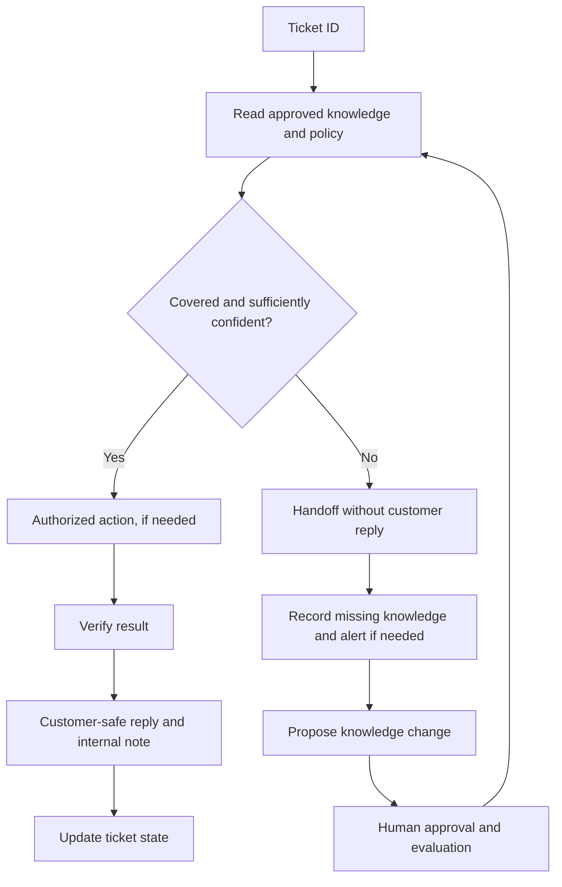

# Run support with a knowledge base and handoffs

> Dated addition — Day 2, 2026-09-16. David's demonstration used a fictional FlyLo Wi-Fi subscription and Stripe sandbox. Its price, refund window, labels, and policies are examples, not Grok Bot product policy.

Start with one workflow and a small set of well-documented issues. David recommended covering the frequent cases first, testing answers and handoffs, then exposing the bot to tickets. Expand from read-only summaries to draft notes and finally authorized replies. [108 · 00:03:49–00:05:43 and 00:08:31–00:09:52](../../timelines/108.md), [111 · 00:02:15–00:03:36](../../timelines/111.md).

## Configure the knowledge and roles

- **Public Docs:** material suitable for customers, including approved help-center answers.
- **Internal Policies:** staff-only rules used to make decisions; do not copy them into customer replies.
- **Reply playbook:** the ordered procedure, confidence/handoff rules, allowed actions, and ticket-state conventions.

These three pieces were stored in Notion. **Plain** was the demonstrated ticketing connector; **Build** handled setup, **Reply** handled tickets/internal Q&A, **Alert** notified staff, and **Tune** proposed improvements. Slack and Stripe supported alerts and sandbox billing actions. [108 · 00:08:31–00:09:52](../../timelines/108.md), [109 · 00:00:00–00:09:59](../../timelines/109.md).

## Process each ticket

1. Read the exact ticket/thread. Prefer its ID over a customer's first name.
2. Consult approved public answers and the applicable internal policy.
3. Decide **Reply** or **Handoff**. Missing, ambiguous, or low-confidence coverage leads to handoff with no customer reply.
4. Perform only the applicable authorized action, such as a sandbox refund in the demonstration; verify the result in the system of record.
5. Write a customer-safe reply when covered, plus an internal note recording the decision, confidence, root issue, and source links.
6. Apply the configured ticket state. The demo used `GB-Seen`; replies assigned the ticket, added `GB-Answered`, and snoozed it as Waiting for Customer. Handoffs unassigned it.

Sources: [109 · 00:02:20–00:09:59](../../timelines/109.md), [111 · 00:01:20–00:02:15](../../timelines/111.md).

Diagram: synthesis of [109–111](../../timelines/109.md). The evaluation stage combines the live approval demo with the GitHub review pattern suggested in Q&A.

## Improve the system without inventing policy

In the pass-sharing example, Reply found no approved answer, left a handoff note, and asked Tune for a knowledge-base change. David supplied the actual policy and approved the write. Only then did Reply retry and cite the new section. A bot identifying a gap does not establish what the missing policy should be. [110 · 00:00:00–00:03:50](../../timelines/110.md).

For a GitHub-backed knowledge base, David proposed a PR, BugBot review, human/code-owner approval, and evals/traces against the proposed branch. This was a suggested governance pattern, not a live implemented pipeline in these clips. [111 · 00:00:00–00:01:20](../../timelines/111.md).

## Internal answers and validation

The same knowledge supported staff questions in Slack. The demo required inviting the bot to the channel and resolving auto-review approvals. Staff-only detail belonged only in clearly internal contexts; ambiguous recipients were to be treated as customers. [109 · 00:02:20–00:06:30](../../timelines/109.md), [110 · 00:03:50–00:07:20](../../timelines/110.md).

Before increasing autonomy, verify a covered case, an uncovered case, a policy-dependent action, an internal question, and a proposed KB change. Check the actual ticket and action state, public/internal separation, and handoff behavior. Start with scoped read permissions and add approved writes as the workflow proves itself. [110 · 00:07:20–00:08:25](../../timelines/110.md), [111 · 00:02:15–00:03:36](../../timelines/111.md).

For cost controls, see [reduce token usage](reduce-bot-token-use.md). The presenter's $1–2 ticket example was anecdotal consumption, not pricing or a forecast.
