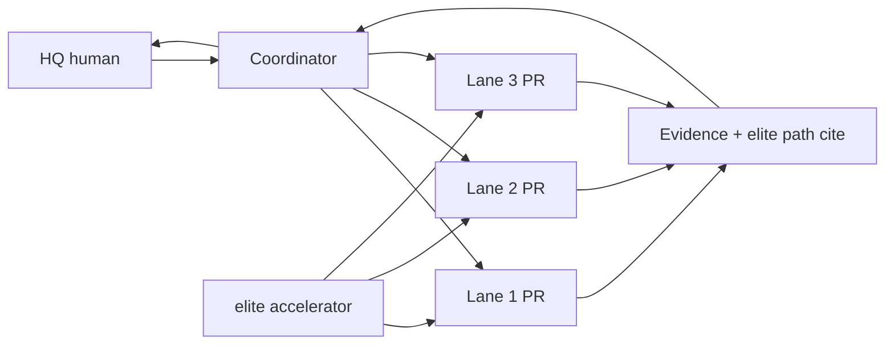

# Run Galaxy cloud-programmer ops (franchise build)

> **Standing order — N L, 2026-09-23.** Editorial ops playbook for HQ running a multi-agent Cursor cloud-programmer fleet to **build a franchise** from **elite** as accelerator. Pattern sources: [operate a bot team](operate-a-bot-team.md), [FlyLo fleet](../reference/flylo-engineering-fleet.md), [why a fleet](../explanation/why-a-fleet-of-bots.md). Named repos, boards and approval gates belong to your deployment.

## Shape: 3-eng / 3-day

| Role | Count | Job |
|---|---:|---|
| HQ coordinator | 1 | Owns scope, boards work, inspects evidence, blocks merges. Not a pass-through for agent summaries. |
| Cloud-programmer lanes | ≤3 | One Cursor cloud agent per PR stream; parallel only when slices do not touch the same elite paths. |
| Human (N) | 1 | Fires tasks, says merge, says **ESTAMOS LISTOS** before destructive steps. |

**3-day** = time-box like the event builds: HECHO slices daily; no scope creep into invented GTM on day 1.

## Coordinator vs parallel lanes

**Coordinator lane** — sequence, integrate, rebase conflicts, reject weak proof. Mirrors Cupcake Eng and Craig: orchestrate → supervise → prove. [084 · 00:08:40–00:09:58](../../timelines/084.md); [FlyLo fleet](../reference/flylo-engineering-fleet.md).

**Parallel lanes** — launch only when:
1. Slices are independent (no shared elite files or migration).
2. Each lane already has a boarded row and a clean task title.
3. Follow-ups on an open PR stay on **that** lane; never open a second PR for the same slice.

When lanes would collide, coordinator runs solo until the conflict surface is clear.

## Hard rules

### Every PR cites elite paths — or FAIL

PR body must list **which elite paths** the change reads, copies, or overrides (file or module paths). Missing cite = **FAIL**; do not advance the stage ladder. Franchise code adapts elite; it does not silently fork.

### HECHO-first slices

Ship **one vertical slice to HECHO** (done with proof) before starting the next. HECHO means: runnable on tip, evidence attached, coordinator accepted — not “agent said done.” Order: core franchise path → adjacent slice → polish. Same evidence bar as [verification](build-and-maintain-verification.md) and FlyLo **Ready** (pre-merge; **Done** = merged only).

### No invent SDR / GTM

Do not fabricate prospecting, outreach, ICP, or campaign flows. When sales or growth work appears, pull procedures from Galaxy canon — [SDR](run-sdr-prospecting.md), [sales workflows](run-sales-workflows.md), [ICP](define-icp-and-plan-outreach.md), [growth playbook](build-a-growth-playbook.md) — and mark anything not covered as **GAP**. Demo bots and Marketplace names are examples, not your franchise defaults.

### No REVESTEX wipe without ESTAMOS LISTOS

**REVESTEX** = reset franchise overlay back toward elite baseline (delete custom layer, mass revert, or “start clean” on branched paths). **Forbidden** until HQ posts **ESTAMOS LISTOS** on the task/board. Until then: patch in place, revert single commits, or flag blocker.

### Galaxy = field guide, not e2e / IaC

This repository is a **field guide** to historical Grok Bot Galaxy patterns. It does not deploy your franchise, wire CI, or substitute your repo’s `AGENTS.md`, environment, or secrets. Read one guide + cited evidence; execute in **your** runtime. See [llms.txt](../../../llms.txt).

## Daily loop (HQ)

1. **Scope** — restate franchise outcome; name elite entry paths.
2. **Board** — one row per lane; fields per [FlyLo](../reference/flylo-engineering-fleet.md) (Task name, Owner, Stage, PRs, Cloud agent, Last commit).
3. **Launch** — ≤3 cloud agents; coordinator watches, does not code the same files.
4. **Review** — elite path cite present? HECHO evidence? If no → FAIL and reply on the same agent.
5. **Merge** — human only; coordinator recommends after **Ready**.

Related: [ship with cloud agents](ship-with-cloud-agents.md), [shared playbook](maintain-a-shared-playbook.md), [PR review routing](wire-pr-reviews-into-slack.md).
