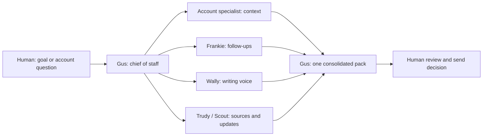

# Run a post-sales desk through one chief of staff

Evidence: Day 3, 2026-09-17. Blake Schuller's **FlyLo** customer-success demonstration used account scenarios and explicitly held customer messages for human review.

Start by describing your working day: responsibilities, recurring interruptions, broken processes, work you enjoy and work you want to retain. Blake used a 10–15 minute voice memo and asked the first bot to design a useful system around it.

Give a chief of staff one clear output contract. Blake mainly talked to **Gus**, who routed work to Frankie (follow-ups), Wally (writing voice), Trudy (sourced answers), Scout (internal updates) and account specialists. One account bot per account was suggested for small or medium books; the talk did not establish it as the right design for thousands of accounts.

| Job | Input and expected output |
|---|---|
| Morning status board | Overnight issues, meetings and unfinished commitments |
| Call prep | Account/attendee context shortly before the call |
| Follow-up desk | Call notes → email draft, internal Slack draft and requested materials |
| Promise Keeper | Commitments you made → reminders to follow through |
| Ask Watch | Requests awaiting another person's response → follow-up visibility |
| Account Reset | Risk, people, blockers, open promises, recent channel context and next actions |

For follow-ups, Granola notes supplied the source record. “I'm done with the Harbor call” triggered a pack of Gmail and Slack drafts plus an ROI PDF. **Drafts only; nothing sent** was the explicit operating rule. Teach audience-specific tone with your own prior writing and review the resulting drafts.

For competing priorities, call a staff meeting with the available time, account context and decision rules. Ask each specialist for its top one or two priorities and reasons, including disagreement. Gus returned **go first / next / hold**. This was a deliberation technique, not proof that disagreement eliminates bias.

Two demo limits matter:

- The Google Meet join was described and partially attempted, but sign-in was skipped. The takeaways shown were a demo backup, not evidence of that live call having been attended.
- Franny's ROI form ultimately showed **Published / Accepting responses / Anyone with the link**. Sending the link remained held. Treat creating, publishing and sending as separate states; “draft only” in bot prose did not undo the visible publication.

Evidence: team and use cases in [135 · 00:02:55–00:09:59](../../timelines/135.md); follow-up/reset demos and incomplete Meet join in [136](../../timelines/136.md); staff meeting and form state in [137 · 00:00:00–00:03:10](../../timelines/137.md); voice onboarding in [137 · 00:03:10–00:04:21](../../timelines/137.md) and [138 · 00:00:00–00:03:00](../../timelines/138.md).

Next: [Improve the system from feedback](improve-bot-system-with-feedback.md).
