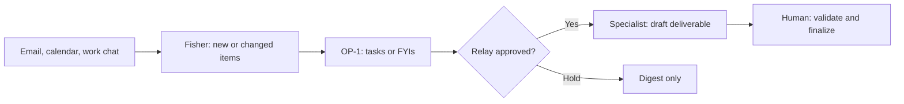

# Route RevOps requests from inbox to specialist

Evidence: Day 3, 2026-09-17. Matthew Silberman's configured workflow, not an automatic default for every bot.

Use this when messages arrive across email, calendars and work chat, but the useful result is a reviewed deliverable rather than another digest.

1. Give an inbox bot access to the relevant sources and a review schedule. In the demo, **Fisher** ran a weekday receive routine and sent only new or changed items to **OP-1**, the chief of staff.
2. Ask the chief of staff to distinguish tasks, FYIs and items to ignore. Where a message is ambiguous, read the surrounding conversation before deciding what it asks for.
3. Define specialist ownership and the context each specialist needs. The Territory Planner received the account context, CRM data and rules of engagement.
4. Review the proposed handoff. OP-1 offered **Approve — relay to Territory Planner** or **Hold — digest only**.
5. Have the specialist return a draft with its reasoning; the human validates and finalizes it.

The scrubbed demonstration used a fictional territory dispute: two account executives claimed the same account. The specialist applied the demonstrated organization's HQ-region policy. That policy is example business logic, not a Grok Bot rule.

An adapted brief:

> Review the connected inboxes on the agreed schedule. Send only new or changed tasks and FYIs to my chief of staff. Read conversation context before inferring a task. Propose the specialist and required sources. Return a draft decision for my review, with the policy and account facts that support it.

For complex jobs, Matthew recommended splitting the work into concrete steps such as sign in, retrieve a report, interpret it against other data, then prepare the deliverable. Separate bots are useful where ownership and context differ; they are not mandatory for every step.

Evidence: [115 · 00:04:40–00:09:35](../../timelines/115.md); decomposition in [117 · 00:04:20–00:06:20](../../timelines/117.md); workflow recap in [131 · 00:01:46–00:05:35](../../timelines/131.md).

Next: [Build a CRM lead-review tool](build-crm-lead-review-tool.md) or [keep the bot system lean](improve-bot-system-with-feedback.md).
