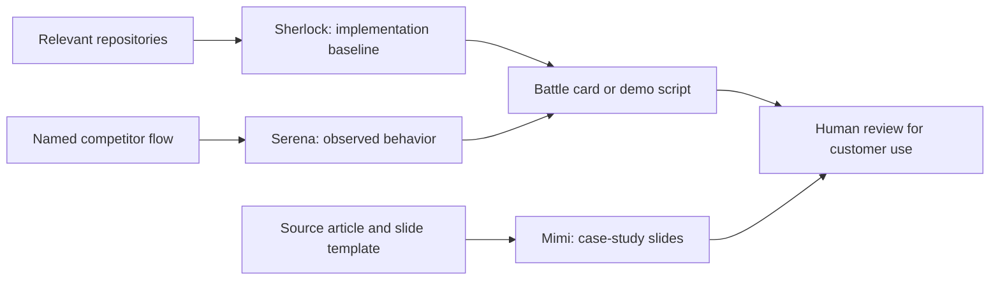

# Run a sales-engineering workflow

> Dated addition — Day 2, 2026-09-16. Distilled from the existing timelines; the FlyLo examples are a sandbox, and the original recordings were not revalidated for this guide.

Use this workflow to answer a technical customer question, compare a competitor, or prepare a case-study slide. Start with the one job you need; the whole demo fleet is optional.

## Choose the specialist

| Job | Demo bot | Required context | Output |
|---|---|---|---|
| Explain actual implementation | Sherlock | Relevant repositories and customer question | Technical findings plus customer-safe wording |
| Compare a real product flow | Serena Williams | Named competitors, test path, Sherlock's baseline | Observations, differences, proposed opportunities |
| Produce a case study | Mimi | Source article, master deck, slide template | Logo and problem / solution / impact / quote slides |
| Prepare battle cards or a demo script | Battle Card Blair / Demo Drake | Sherlock's findings and Serena's observations | Short talk track with honest limitations |

Sources: [068 · 00:01:40–00:09:43](../../timelines/068.md), [071 · 00:00:00–00:03:15](../../timelines/071.md).

## Run the work

1. **Ground the technical answer.** Connect the repositories that implement the feature. Ask Sherlock to distinguish supported behavior, missing behavior, and what a customer should be told. In the demo it delegated repository inspection to connected Cursor cloud agents. The resulting FlyLo baseline explicitly warned that the README overstated the implementation. [068 · 00:05:30–00:09:43](../../timelines/068.md), [069 · 00:07:30–00:09:59](../../timelines/069.md).
2. **Scope competitor testing.** Give Serena a concrete flow and stopping point. The demonstrated brief was search → fare → extras → checkout, stopping before payment. Have her compare observations against Sherlock's baseline, rather than a feature wishlist. [069 · 00:00:00–00:03:30](../../timelines/069.md).
3. **Combine the evidence.** Put the specialists in a group chat and ask which useful differentiator is low effort to build. In FlyLo, existing manage-booking and calendar APIs made unfinished UI attractive; round-trip search and bags required deeper work. These are findings about that demo codebase. [070 · 00:02:15–00:03:45](../../timelines/070.md).
4. **Make slides from a fixed template.** Supply the source article and an example slide. Mimi used a logo plus problem / solution / impact / quote layout. Review the screenshots and source wording, then ask for the relevant case studies to be shown for a particular customer. [068 · 00:01:40–00:05:30](../../timelines/068.md), [070 · 00:05:30–00:09:59](../../timelines/070.md).
5. **Reuse a proven workflow.** Teach a competitor-blog scan with **Teach a task**, finish the recording, and add a note explaining the signal to prioritize. The demonstrated instruction prioritized AI-related engineering posts. A weekly competitor summary was suggested; it was not a measured service guarantee. [068 · 00:05:30–00:09:43](../../timelines/068.md), [070 · 00:00:00–00:02:15](../../timelines/070.md).

Diagram: synthesis of [068–071](../../timelines/068.md); bot names are demo roles.

## Review the result

Require source-backed claims, an explicit list of gaps, and separate internal technical detail from customer wording. A bot description asking for “no hallucinations” is an instruction, not proof of accuracy. Competitor market claims generated in chat remain unverified unless supported by their cited sources.

If Slides loses its session, the demonstrated recovery was to take control, sign in, resend the source link, and check whether the work had already finished. CAPTCHA and Linux-only application limits were acknowledged. Sending messages and changing production systems remain subject to configured approvals. [070 · 00:05:30–00:07:40](../../timelines/070.md), [071 · 00:03:35–00:09:36](../../timelines/071.md).

Related: [Sales](run-sales-workflows.md), [team coordination](operate-a-bot-team.md), [token usage](reduce-bot-token-use.md).
