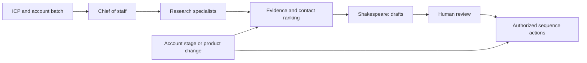

# Build an SDR prospecting workflow

> Dated addition — Day 2, 2026-09-16. Based on Simon's workshop. The FlyLo prospect lists and sequence settings are demonstration examples; no outbound campaign is authorized by this guide.

The demonstrated system combines prospect research, account signals, copy, and sequence state. Simon used a chief of staff as the control point, but warned against creating more bots than the work requires. [099 · 00:06:28–00:09:59](../../timelines/099.md), [101 · 00:05:55–00:09:05](../../timelines/101.md).

## Build the smallest useful loop

1. **Define the outcome and ICP.** Work back from qualified opportunities to the accounts and people likely to respond. Use closed-won deals, stage-one progression, and call evidence. Store the current ICP as an editable skill so it can change with evidence. [099 · 00:01:39–00:04:25](../../timelines/099.md), [101 · 00:03:45–00:05:55](../../timelines/101.md).
2. **Connect the evidence sources you need.** The demo assigned distinct sources to research specialists; use the table below as a role map, not an installation requirement. [100 · 00:06:00–00:09:59](../../timelines/100.md).
3. **Research a bounded batch.** Specify account IDs/list, fields, scope, and destination. Simon's Web Search bot split a large list into equal slices across low-context “Soldier” bots. Their outputs returned to the commander for spot checks. Parallelism shortens elapsed time; it is not demonstrated to reduce total tokens. [101 · 00:01:45–00:03:45](../../timelines/101.md), [102 · 00:00:00–00:04:05](../../timelines/102.md).
4. **Rank from evidence.** Combine usage, account stage, recent interest, known objections, and organizational role. Keep the canonical contact/sequence state in a CSV. Surface the actionable shortlist to the human instead of every research message. [100 · 00:00:45–00:06:00](../../timelines/100.md), [101 · 00:00:00–00:01:45](../../timelines/101.md).
5. **Draft and critique.** Teach the copy bot with your own successful external messages, weighting recent positive replies. Review factual accuracy and voice; a self-assigned confidence score is not an independent quality measure. The demo kept outputs as drafts with explicit approval before sending. [099 · 00:04:25–00:06:28](../../timelines/099.md), [100 · 00:03:00–00:06:00](../../timelines/100.md).
6. **Keep state synchronized.** The demo described a Salesforce stage-change trigger to remove advancing accounts from outbound, and a loop that re-ranked a closed-loss account when its known product blocker was resolved. Verify these transitions before relying on a scheduled workflow. [100 · 00:00:45–00:03:00 and 00:06:00–00:09:59](../../timelines/100.md).

| Demo specialist | Source | Contribution |
|---|---|---|
| PLG bot | Salesforce | Signups, usage-related account context, closed loss |
| Enrichment bot | Amplemarket | Contact details and verification |
| Company Research | Sumble | Technology stack, hiring, organization |
| Voice of the Customer | Gong | Call context and reasons for lost deals |
| Usage bot | Databricks | Product usage signals |
| Web Search + Soldiers | Exa / web | Parallel external research |
| Shakespeare | Writing examples + research | Personalized email drafts |

Diagram: synthesis of [099–102](../../timelines/099.md); arrows describe the workshop pattern, not built-in defaults.

## Schedule after validating a sample

The workshop examples included 50 prospects/day, prioritizing the top five, and an eight-step, 21-day email/LinkedIn sequence. These are Simon's settings, not a recommended universal cadence. He suggested comparing a weekly batch with daily runs to fit the workload and cost. Reuse an existing specialist or routine when possible. [100 · 00:00:45–00:06:00](../../timelines/100.md), [102 · 00:00:00–00:04:05](../../timelines/102.md).

Completion means the batch has traceable evidence, reviewed copy, and correct sequence state. It does not mean a meeting or reply is guaranteed. See [token usage](reduce-bot-token-use.md) and [team coordination](operate-a-bot-team.md).
