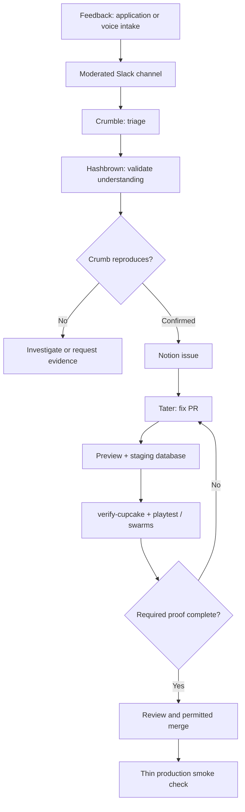

# Turn feedback into verified fixes

Evidence: Day 3, 2026-09-17. This is the studio's configured feedback factory. Bot names and verification skills are local to that demonstration.

Start with a small loop: receive feedback, classify it, reproduce a defect, and create a ticket. Add automatic fixes only after the verification rules are explicit.

1. Collect feedback into a shared channel. Thursday Arena's authenticated form sent moderated input to Slack; a separate xAI voice-agent intake later reached the same channel through a webhook.
2. Treat submissions as untrusted input. The hosts discussed off-topic/profanity filtering, suspicious links, prompt injection, input sanitization and rate limits. These were application controls, not a guarantee that model review makes arbitrary input safe.
3. Use **Crumble** to triage, **Hashbrown** to check the interpretation, and **Crumb** to reproduce. File confirmed issues in Notion.
4. Give **Tater** a confirmed issue and a bounded fix. For an unclear human-reported symptom, ask for an investigation first and explicitly hold the PR until the diagnosis is returned.
5. Run the project's verification skill and independent playtesting against the PR preview. Collect evidence before review and merge.

**Dated clarification, 2026-09-17:** the on-screen rules in clip 127 explicitly said not to make production the test harness. Use a Vercel PR preview with PlanetScale staging, have the playtester use that same preview, and run swarms on preview or local plus staging. Production gets a thin smoke check after deployment. A later ad hoc prompt in clip 142 requested reproduction on the live site; preserve that as an observed action, not a replacement for the documented staging rule.

`/verify-cupcake` was the game's own skill. pstack's swarm skill coordinated Cursor cloud agents with separate computers; the presenters used “fuzzing” to mean actively exercising UI paths and edge cases. Neither name establishes a built-in Grok Bot feature available in every workspace.

A failure illustrated why gates matter: PR #124 had already merged before Play finished, so the factory recorded no PASS/FAIL for it. Green CI alone was not equivalent to completed playtesting.

**Closing evidence:** Lauren later said she normally reads code and reviews agent anti-patterns more rigorously than she did during this fast build. Deduplication also missed overlapping work. In the final clip, Matt reported that a bad SQL query from the factory had taken production down; he reported recovery around 00:07:33. The last sponsor test still failed moderation. The demonstrated automation was useful but fallible: PR volume, a bot's “Done,” and a merged change each require separate evidence of the intended runtime result.

Evidence: initial investigation/triage brief in [124 · 00:03:45–00:09:10](../../timelines/124.md); roles and verification in [126 · 00:01:00–00:07:50](../../timelines/126.md); exact staging rules in [127 · 00:00:00–00:01:20](../../timelines/127.md); missed playtest in [113 · 00:05:40–00:06:38](../../timelines/113.md); later production repro in [142 · 00:04:05–00:06:20](../../timelines/142.md); reusable verification skills in [143 · 00:04:50–00:07:45](../../timelines/143.md); review rigor in [153 · 00:05:46–00:06:58](../../timelines/153.md); duplicate work in [155 · 00:02:02–00:03:54](../../timelines/155.md); outage, recovery and failed final test in [157](../../timelines/157.md).
